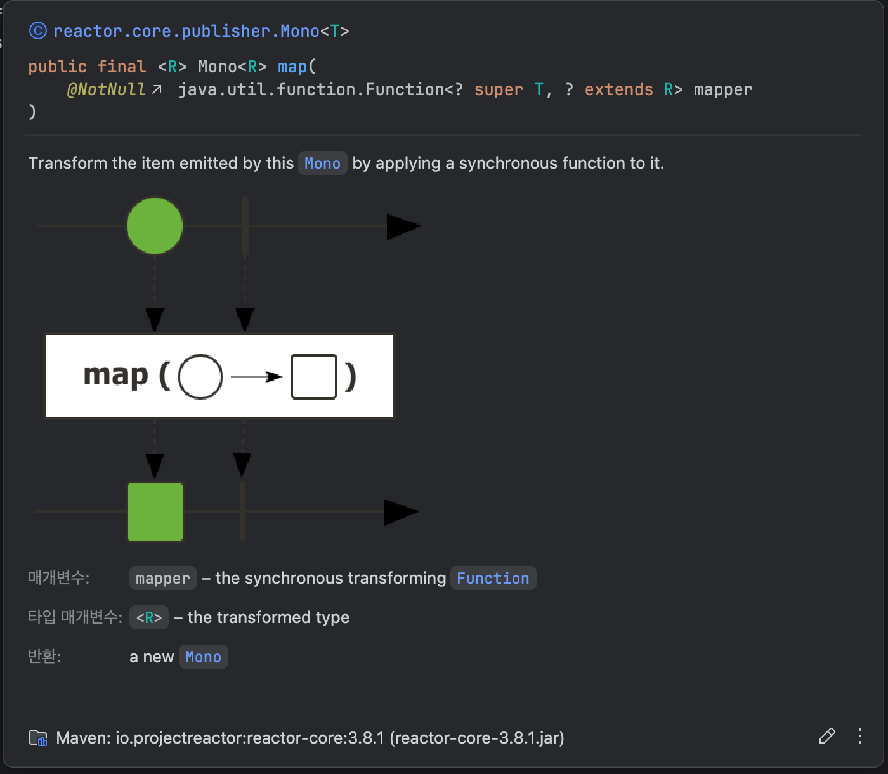

[지난 글](https://bak-libra26.co.kr/posts/%EA%B0%9C%EB%B0%9C/%EC%9E%90%EB%B0%94/%EB%A6%AC%EC%95%A1%ED%8B%B0%EB%B8%8C/%EB%A6%AC%EC%95%A1%ED%8B%B0%EB%B8%8C_%EC%8A%A4%ED%8A%B8%EB%A6%BC%EC%A6%88%EC%99%80_%ED%94%84%EB%A1%9C%EC%A0%9D%ED%8A%B8_%EB%A6%AC%EC%95%A1%ED%84%B0) 에서 리액티브 스트림즈에서 명세한 4개의 인터페이스와 각 인터페이스가 어떻게 상호작용하는지 간단하게 알아봤습니다. 

- **Reactive Streams의 4대 인터페이스**
    - `Publisher`: 데이터를 발행
    - `Subscriber`: 데이터를 소비
    - `Subscription`: Publisher와 Subscriber를 연결
    - `Processor`: Publisher와 Subscriber를 모두 구현한 중개자

이번 글에서는 Reactor에서 이 인터페이스들을 실제 구현한 클래스들을 활용해 코드를 작성하는 방법을 알아보겠습니다.


--- 

## Publisher: 데이터를 생성하자

Reactor에서는 **`Publisher`를 구현한 대표적인 클래스가 `Mono` 와 `Flux` 입니다.** `Mono`는 0 ~ 1 개의 데이터를, `Flux`는 0 ~ N 개의 데이터를 **데이터 스트림** 으로 다룹니다.

`데이터 스트림` 이란 간단히 말하자면 컬렉션처럼 메모리에 이미 다 올라와 있는 값을 한 번에 처리하는 것이 아니라, **나중에 도착할 수도 있고, 여러 번 나눠서 도착할 수도 있는 데이터 흐름 전체를 하나의 스트림으로 표현한다** 는 의미입니다. 
말이 조금 이해하기 어려울 수 있어서, 아래 예시로 보는 게 더 이해하기 쉽습니다.

- **`Mono`:**

    > **상황:** **HTTP 요청 후, 응답 처리**
    > **예시:** 외부 API 호출한 경우, 요청 에 대한 응답이 정상적으로 올 수 있으나 에러가 발생하여 아무 값 없이 끝날 수 있습니다.
    > **결론:** 이렇게 **“언젠가 한 번 올 수도 있고, 안 올 수도 있는 결과”** 를 **`Mono<Response>`** 같은 형태로 표현합니다.

- **`Flux`:**
    
    > **상황:** **서버에서 계속 푸시되는 이벤트 스트림(SSE, WebSocket)**
    > **예시:** 값이 0개일 수도 있고, 몇 개만 오다가 끝날 수도 있고, 이론상 무한히 계속 들어올 수도 있습니다.
    > **결론:** 이런 **“시간을 두고 0 ~ N 개의 값이 흘러오는 흐름”** 를 **`Flux<Event>`** 로 표현합니다.

---

### Publisher: 기본 예제

Mono/Flux 를 생성하는 방법을 알아보겠습니다.

- 예제 코드
```java
// Mono
public static <T> Mono<T> just(T data) { ... }a
public static <T> Mono<T> justOrEmpty(@Nullable Optional<? extends T> data) { ... }
public static <T> Mono<T> empty() { ... }

// Flux
public static <T> Flux<T> just(T... data) { ... }
public static <T> Flux<T> justOrEmpty(@Nullable Optional<? extends T> data) { ... }
public static <T> Flux<T> empty() { ... }

/**
 * Mono/Flux 실사용 예시
 */
Mono.just("Hello");
Mono.justOrEmpty(Optional.of("Hello"));
Mono.empty();

Flux.just("Hello", "World");
Flux.justOrEmpty(Optional.of("Hello"));
Flux.empty();
```

위 예제처럼 `Mono`나 `Flux` 인스턴스는 `just(..)`, `justOrEmpty(..)`, `empty(..)` 같은 메서드를 사용해서 가장 단순하게 생성할 수 있습니다. 이렇게 Mono/Flux를 새로 만들어 내는 연산자를 **생성 연산자**라고 부르며, 이 세 가지 외에도 `fromIterable()`, `fromCallable()`, `defer()`처럼 다양한 생성 연산자가 존재합니다.

--- 

### Publisher: 여러가지 생성 연산자

- **`just(data)`:** 이미 값이 존재할 때
- **`justOrEmpty(optional)`:** 값이 있을 수도, 없을 수도 있을 때.
- **`empty()`:** 아무 값도 발행하지 않고 스트림을 끝내고 싶을 때.
- **`fromIterable(iterable)`:** 이미 있는 List, Set 같은 컬렉션을 Flux로 바꾸고 싶을 때.
- **`fromCallable(supplier)`:** 실행 시점에 동기 함수 하나를 호출해서 그 결과를 Mono로 감싸고 싶을 때.
- **`defer(supplier)`:** 구독할 때마다 새로 생성하고 싶을 때.

위 6가지 생성 연산자 이외에도 다양한 생성 연산자가 존재하며, 상황에 맞게 필요한 생성 연산자를 찾아서 사용하면 됩니다.

---

### Publisher: 생성한 후엔 ?

> - **흐름 상기하기**
> `Publisher.subscribe(Subscriber)` → `Subscriber.onSubscribe(Subscription)` → `Subscription.request(n)` → `Subscriber.onNext(...)`

위와 같이 여러 가지 생성 연산자가 존재하지만, 이들은 모두 **Mono/Flux 인스턴스를 새로 만들어 내는 생성 연산자**입니다. `Mono.just(value)`처럼 어떤 연산자는 이 시점에 이미 값을 Mono/Flux 안에 담아 두기도 하지만, 아직 Subscriber에게 값을 전달하지는 않습니다. 생성된 Mono/Flux는 이후 연산자를 체이닝하고, 마지막으로 `subscribe()`가 호출되는 시점에 비로소 내부에 들고 있던 값을 실제로 발행하기 시작합니다.

## Subscriber: 데이터를 소비하자.

`Mono`와 `Flux`는 생성만 해서는 아무 일도 일어나지 않고, 결국 **subscribe() 메서드를 통해 누군가가 데이터를 소비할 때** 비로소 흐름이 시작됩니다.

- **`subscribe()` 사용 예시**
    ```java
    // Mono.subscribe(Consumer<T> consumer)
    Mono.just("Hello World")
        .subscribe(System.out::println);

    // Flux.subscribe(Consumer<T> consumer)
    Flux.just("Hello", "World")
        .subscribe(System.out::println);
    ```

그렇다면 `subscribe()`는 언제, 어떤 식으로 사용하면 좋을까요? 

- **`subscribe()` 언제 호출할까 ?**
    1. 직접 subscribe()를 호출해 스트림을 끝내는 경우
        
        > 예시: 스케줄러, 배치 등

    2. 프레임워크가 내부에서 subscribe()를 대신 호출해주는 경우
    
        > 예시: 컨트롤러/핸들러 메서드가 Mono / Flux를 반환하는 WebFlux 애플리케이션


대부분의 경우 Spring WebFlux 를 사용해 개발하며, 이때는 프레임워크 내부에서 subscribe()를 호출해 주기 때문에 비즈니스 코드에서 직접 subscribe()를 호출할 일은 많지 않습니다. 
다만 스케줄러나 배치/백그라운드 작업처럼 반환값 없이 메서드 내부에서 스트림을 끝내야 하는 경우에는 직접 subscribe()를 호출해야 합니다.

---


## Operator: 데이터를 가공하자.

- **예제 코드**
    ```java
    Flux.just("Hello", "World")
        .map(String::toUpperCase)
        .filter(s -> s.startsWith("H"))
        .subscribe(System.out::println);
    ```

[Mono / Flux: 데이터를 생성하자](#Mono/Flux:데이터를생성하자) 와 [Subscriber: 데이터를 소비하자](#Subscriber:데이터를소비하자) 를 통해 위 예제의 1번째 줄(Flux.just…)과 4번째 줄(subscribe…)이 어떤 역할을 하는지는 살펴봤습니다. 그렇다면 2번째 줄과 3번째 줄, 즉 map()과 filter()는 어떤 역할을 하고 있을까요?

---

### Operator: 이해해보기

위 예제의 `map()`, `filter()` 와 같은 메서드를 리액터에서는 `연산자(Operator)` 라고 부릅니다. 자바 `Stream API` 에 익숙하시다면, 업스트림에서 들어온 데이터를 처리해서 다음 단계(다운스트림)로 넘겨주는 역할이라는 것도 쉽게 떠올릴 수 있을 것입니다.

`리액티브 스트림즈` 관점에서 보면 이 연산자들은 겉으로는 그냥 `map()`, `filter()` 메서드 호출처럼 보이지만, 실제로는 위에서 값 받아서 처리하고, 다시 아래로 흘려보내는 중간 단계로 동작합니다. `리액터` 내부에서는 `FluxMap`, `FluxFilter` 같은 클래스들이 이 일을 맡고 있는데, 이 친구들이 “위에서 받고 → 가공해서 → 아래로 전달하는” 역할을 합니다.


즉, 연산자는 `map()`, `filter()`와 같은 메서드를 의미하며, **위쪽에서 올라오는 데이터를 받아 가공한 뒤, 그 결과를 다시 아래쪽으로 전달하는 중간 처리자 역할을 하는 메서드*** 입니다.

---

### Operator: 마블 다이어그램(Marble Diagram)

리액터에는 셀 수 없을 정도로 많은 연산자가 존재합니다. 이러한 연산자를 모두 외우고 사용하려고 하면 결국엔 실용적이지 않습니다. 그렇다면 필요할 때마다 연산자를 찾아서 사용해야 하는데, 이때 가장 큰 도움이 되는 것이 바로 **마블 다이어그램(Marble Diagram)** 입니다.

마블 다이어그램은 각 연산자가 **데이터 스트림을 어떻게 변형시키는지 시간 흐름에 따라 시각적으로 보여주는** 도구입니다. `IntelliJ IDEA`, `VS Code` 같은 IDE, 또는 공식 문서에서 연산자를 검색해보면, 종종 이 마블 다이어그램이 함께 제공되는 것을 볼 수 있습니다. 

아래는 `IntelliJ IDEA` 에서 `map` 연산자의 마블 다이어그램입니다.



위의 마블 다이어그램을 보면, 위쪽에는 원 모양의 값이 흘러가고, `map(● → ■)` 박스를 거친 뒤에는 아래쪽에서 네모 모양의 값으로 바뀌어 흘러가는 모습으로 표현됩니다. **즉, 입력 값이 어떤 형태로 들어와서, 연산자를 통과한 후 어떤 형태의 값으로 변환되는지를 한눈에 이해할 수 있게 도와주는 시각화** 입니다.

만약 새로운 연산자를 처음 접했을 때는, Javadoc이나 공식 문서에 있는 마블 다이어그램을 한 번 훑어보면서 “어떤 입력이 들어오면 어떤 출력이 나가는지”를 그림으로 먼저 이해하고, 그 다음에 코드 예제를 보면 좀 더 쉽게 새로운 연산자를 이해할 수 있습니다.

---

> - **정리하기**
> \> `Mono` / `Flux`로 **데이터 스트림을 만들고**
> \> 그 사이에 여러 **연산자(Operator)를 체이닝해 값을 가공한 다음**
> \> 마지막에 `subscribe()`가 호출되는 순간 **실제로 데이터가 흘러가며 소비된다**

