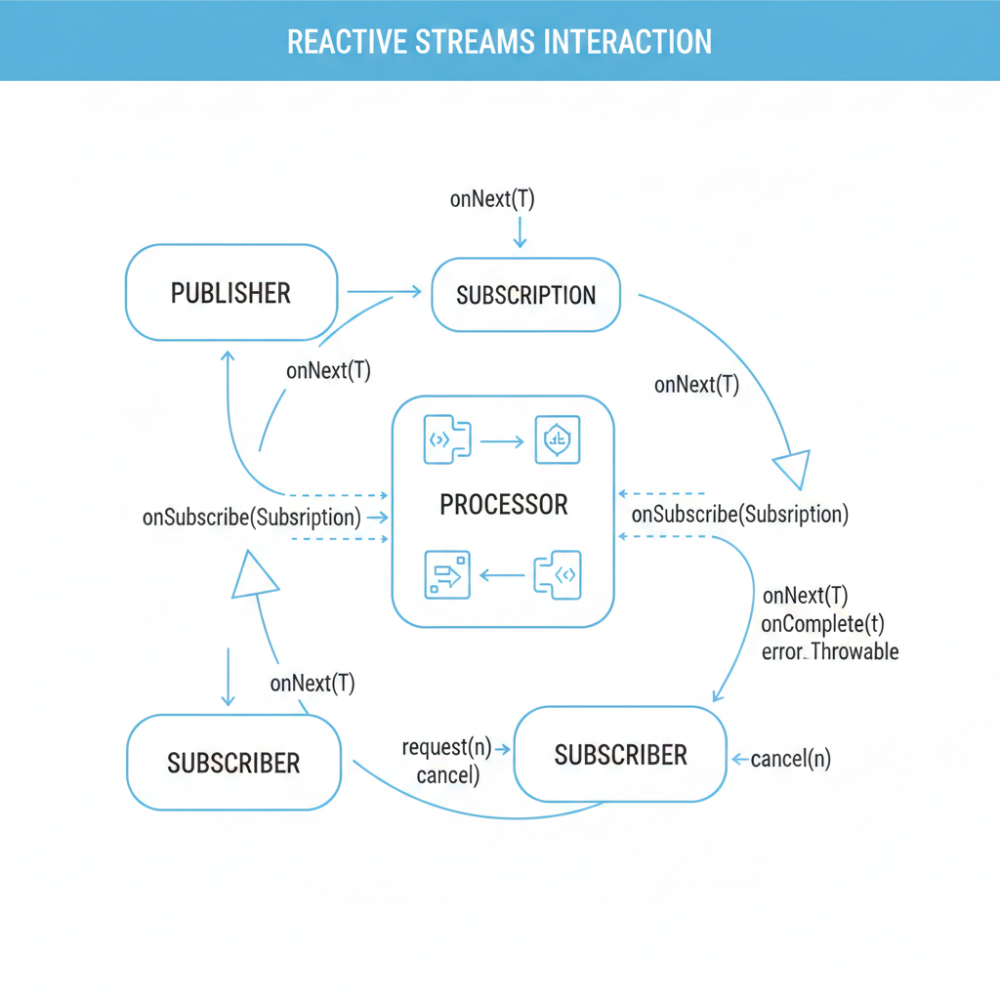

# 리액티브 스트림즈와 리액터(Project Reactor)

**리액티브 스트림즈(Reactive Streams) 는 비동기 스트림을 논블로킹 방식으로 처리하면서, 생산자와 소비자 사이의 속도 차이를 제어하기 위한 표준 사양** 입니다. 

**자바/JVM 생태계에서 서로 다른 라이브러리끼리도 호환되도록 하기 위해 `Publisher`, `Subscriber`, `Subscription`, `Processor` 네 가지 인터페이스와 백프레셔(Backpressure) 규약을 정의** 합니다.

---


## 리액티브 스트림즈(Reactive Streams)

기본적으로 리액티브 스트림즈가 제공하는 기본 인터페이스는 아래의 4가지입니다.

- **리액티브 스트림즈 인터페이스**
  - **Publisher**: 데이터를 발행하는 인터페이스
    ```java
    public interface Publisher<T> {
        public void subscribe(Subscriber<? super T> s);
    }
    ```
    
  - **Subscriber**: 데이터를 받아 처리하는 인터페이스
    ```java
    public interface Subscriber<T> {
        public void onSubscribe(Subscription s);
        public void onNext(T t);
        public void onError(Throwable t);
        public void onComplete();
    }
    ```

  - **Subscription**: Publisher와 Subscriber 사이의 연결 관계를 나타내며, 데이터 전달을 제어하는 인터페이스
    ```java
    public interface Subscription {
        public void request(long n);
        public void cancel();
    }
    ```
    
  - **Processor**: Publisher와 Subscriber의 역할을 모두 수행하는 중개자
    ```java
    public interface Processor<T, R> extends Subscriber<T>, Publisher<R> {
        public void onSubscribe(Subscription s);
        public void onNext(T t);
        public void onError(Throwable t);
        public void onComplete();
    }
    ```

---

### 리액티브 스트림즈에서 데이터가 흐르는 과정


1. **구독 시작**

   - 예제 코드
     ```java
     Publisher publisher = ...;
     Subscriber subscriber = ...;
  
     publisher.subscribe(subscriber);
     ```

     `Subscriber` 는 `Publisher` 에게 데이터를 전달받아 처리합니다. 이를 위해선 `Subscriber` 는 `Publisher` 구독를 구독해야합니다.  

2. **구독 연결 수립 (onSubscribe)**

   - 예제 코드
     ```java
     public void subscribe(Subscriber Subscriber) {
         Subscription subscription = ...;
         subscriber.onSubscribe(subscription);
     }
     ```

     `Publisher` 는 `Subscriber` 에게 데이터를 직접 전달해주는 것이 아닌 `Subscription` 을 통해 전달해줍니다.   

3. **데이터 요청 (request)**

   - 구독 시점에 데이터 요청하는 케이스 
     ```java
     public class CustomSubscriber implements Subscriber<T> {
         @Override
         public void onSubscribe (Subscription subscription){
             subscription.request(1);
         }
     }
     ```
  
   - 특정 이벤트에 데이터를 요청하는 케이스
     ```java
     public class CustomSubscriber implements Subscriber<T> {
         @Override
         public void onSubscribe (Subscription subscription){
             this.subscription = subscription;
         }
  
         public void onEvent () {
             subscription.request(1);
         }
     }
     ```
     
4. **데이터 전달 (onNext) 와 완료 (onComplete)**

   - 예제 코드
     ```java
     public class CustomSubscription implements Subscription {
      
         private final Iterator<String> it = ...; // 원본 데이터
         private Subscriber subscriber = ...;
  
         private long requested = 0;
         private boolean done = false;
      
         public void request(long n) {
             Iterator<String> iterator = it.iterator();
          
             if (done) return;
             if (n <= 0) {
               done = true;
               subscriber.onError(new IllegalArgumentException("n must be > 0"));
               return;
             }
    
             requested += n;
    
             while (requested > 0 && it.hasNext() && !done) {
               requested--;
               String name = it.next();
               subscriber.onNext(name);
             }
    
             if (!it.hasNext() && !done) {
               done = true;
               subscriber.onComplete();
             }
         }
     }
   
     ```

---

### 데이터 처리 흐름

> 아래 이미지는 `Gemini` 를 사용해 생성했습니다



--- 

### 데이터는 왜 이렇게 흐를까 ?

`Subscriber` 가 데이터 흐름의 주도권을 갖는 이유는 `Subscriber` 의 처리 능력에 맞춰 필요한 만큼만 데이터를 요청하기 때문에 **`Publisher` 와 `Subscriber` 사이 버퍼가 과도하게 쌓이는 것을 방지하고 시스템 성능과 안정성을 높이기 위해서** 입니다.

만약 `Subscriber` 가 아닌 `Publisher` 가 데이터 흐름의 주도권을 갖는다면, `Publisher` 는 실제로 데이터를 처리하는 `Subscriber` 의 상태를 모른 채 계속 메세지를 발행할 수 있고, 이로 인해 처리하지 못한 메세지는 큐에 끊없이 쌓여 자원 고갈 또는 지연 증가와 같은 문제가 발생할 수 있습니다.

**이러한 메커니즘을 리액티브 스트림즈에서는 백프레셔(Backpressure)라고 합니다.** 백프레셔는 `Subscriber` 가 `Subscription.request(n)` 을 통해 자신이 처리할 수 있는 데이터 개수를 명시적으로 알려 주고,
`Publisher` 는 이 요청 범위 안에서만 데이터를 발행하도록 함으로써, **빠른 생산자와 느린 소비자 사이의 속도 차이를 흡수하는 흐름 제어 전략** 입니다.


--- 

## 프로젝트 리액터(Project Reactor)

> [**Reactor** is a fourth-generation reactive library, based on the **Reactive Streams specification**, for building non-blocking applications on the JVM](https://projectreactor.io/)

**[Project Reactor](https://projectreactor.io/) 는 리액티브 스트림즈 명세를 구현한 대표적인 라이브러리** 입니다. 리액티브 스트림즈 명세를 구현한 다른 라이브러리로는 `RxJava`, `Akka Streams`, `Java 9 Flow API` 가 있지만,
`Reactor` 는 **`Spring WebFlux` 의 기본 리액티브 엔진이 되는 중요한 라이브러리** 입니다.

`Reactor` 는 논블러킹 I/O, 백프레셔를 지원하며, `Publisher` 인터페이스를 구현한 **Mono(0~1), Flux(0~N) 라는 두 가지 리액티브 타입을 제공** 한다는 특징이 있습니다.

아래에서는 `Reactor` 에서 가장 많이 사용되는 `Publisher` 인 **`Mono`** 와 **`Flux`** 의 특징을 살펴보고 마치도록 하겠습니다. 


---

### Mono (0 ~ 1)

> **Reactor/Mono  : [공식 문서](https://projectreactor.io/docs/core/release/reference/coreFeatures/mono.html)**

- **Mono**는 0개 또는 1개의 데이터만 발행하는 `Publisher` 입니다.
- 주로 HTTP 요청의 응답이나 DB의 단건 조회처리와 같이 **"결과가 하나이거나 없는" 경우에 사용** 됩니다.


---


### Flux (0 ~ N)

> **Reactor/Flux  : [공식 문서](https://projectreactor.io/docs/core/release/reference/coreFeatures/flux.html)**

- **Flux**는 0개부터 N개(무한대 포함)의 데이터를 발행하는 `Publisher` 입니다.
- 리스트, 스트림 데이터, 이벤트 처리 등 **여러 개의 데이터가 지속적으로 들어오는 경우에 사용** 됩니다.


---
