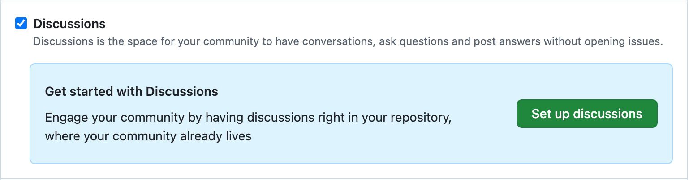
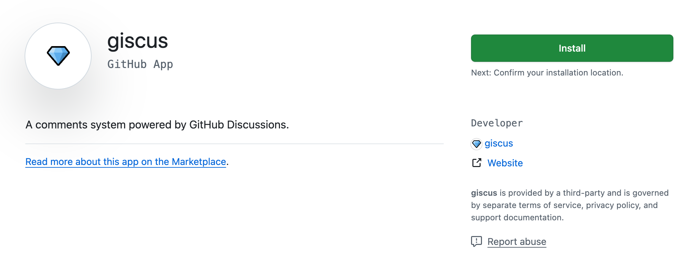
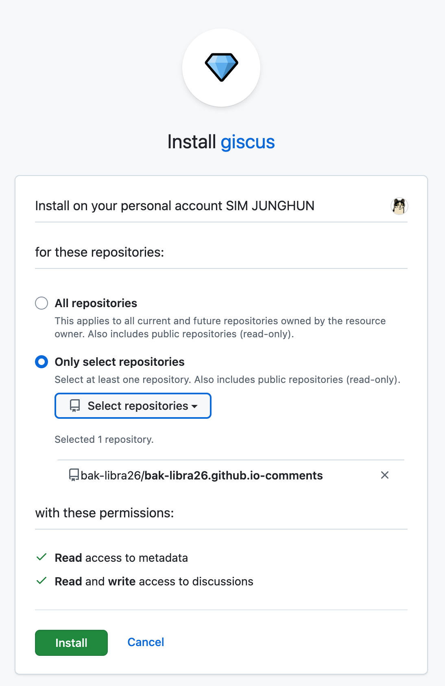
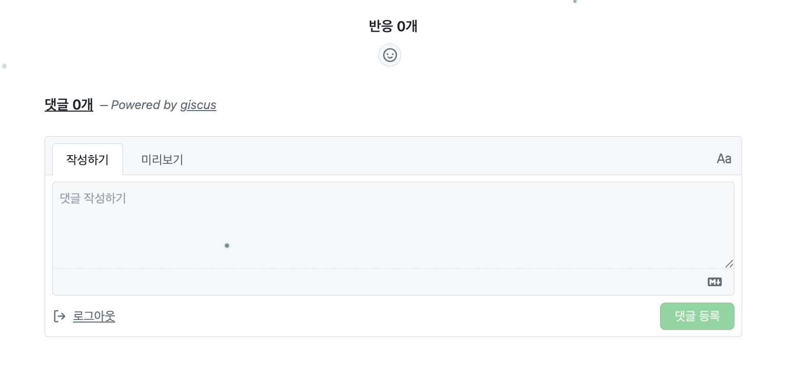

> 깃허브 페이지로 배포한 개인 블로그에 댓글 기능을 추가한 과정을 정리한 문서입니다.

---

2026년 1월, GitHub Pages 로 배포한 개인 블로그에 댓글 기능을 추가하고자 했으나, GitHub Pages 특성상 데이터베이스를 따로 사용할 수 없어 댓글 기능 구현이 까다로웠습니다. 이번 글에서는 GitHub Pages 에 댓글 시스템을 어떻게 추가했는지 정리하였습니다.


## 댓글 솔루션 비교

| 기능 | Utterances | Giscus |
| :--- | :--- | :--- |
| 기반 | GitHub Issue | GitHub Discussion |
| 대댓글 | X (태그 방식) | O (중첩 구조) |
| 리액션 | X | O |
| 테마 지원 | 기본 (github-light 등) | 다중 테마, 다크모드 자동 |
| 언어 | 영어 중심 | 다국어 (한국어 포함) |
| 업데이트 | 상대적으로 느림 | 활발 |
| 장점 | 가볍고 간단, 개발자 친화 (마크다운) | 자연스러운 대화, 알림 편리 |

댓글 솔루션으로는 Utterances와 Giscus 외에 Disqus 같은 서비스도 있지만, **Disqus는 `무료 플랜에서 광고가 붙는다`** 는  단점이 있어 고려하지 않았습니다.


### 댓글 솔루션 선택 기준

`Utterances`와 `Giscus`를 비교해본 결과, **`Giscus`가 대댓글 기능을 지원하고 다양한 테마 옵션을 제공하며 지속적으로 업데이트가 이루어지고 있어 최종적으로 선택**하게 되었습니다.

---

## 댓글 솔루션: Giscus

[Giscus 웹사이트](https://giscus.app/ko)는 GitHub Discussions를 기반으로 작동하는 댓글 솔루션입니다.


### Giscus: 장점
- **무료**: GitHub를 사용하므로 별도의 호스팅 비용이 없습니다.
- **광고 없음 & 추적 없음**: Disqus 같은 서비스와 달리 광고나 불필요한 추적이 없습니다.
- **GitHub 연동**: 개발자 블로그에 방문하는 대부분의 독자가 GitHub 계정을 가지고 있어 접근성이 좋습니다.
- **다크 모드 지원**: 다양한 테마를 지원합니다.

---

### Giscus: 스크립트 생성하기

1. **저장소 설정 (Repository Settings)**

    > Giscus 는 댓글을 관리할 레포지토리가 필요합니다. 또한 해당 레포지토리는 **Public**이어야 하고 **Discussions** 기능이 켜져 있어야 합니다.

    1. `댓글 레포지토리` -> `Settings` > `General` > `Features` 섹션에서 **Discussions** 체크박스를 활성화
        

2. **Giscus 앱 설치**

    1. [Giscus 앱 페이지](https://github.com/apps/giscus)로 이동 후, **Install** 버튼을 클릭
        
    2. 댓글 기능을 적용할 저장소를 선택하고 설치를 완료
        

3. **Giscus 설정 및 스크립트 생성**

    > [Giscus 공식 홈페이지](https://giscus.app/ko)에 접속하여 설정을 진행합니다.

    1. **저장소(Repository)**: `username/repo` 형식으로 입력하여 연결 여부를 확인합니다.
    2. **페이지 - Discussion 연결(Page ↔️ Discussions Mapping)**:
        - 저는 `pathname`을 기준으로 설정했습니다. 
        
    3. **Discussion 카테고리(Discussion Category)**:
        - 댓글이 생성될 카테고리를 선택합니다. `General`이나 `Announcements`를 사용하거나 `Comments`라는 카테고리를 새로 만들어 사용하면 됩니다.
    4. **기능(Features)**:
        - `메인 포스트 위에 댓글 상자 배치`, `대댓글(Lazy loading)` 등 필요한 옵션을 선택합니다.
    5. **테마(Theme)**: 블로그 디자인에 맞는 테마를 선택합니다.

설정을 마치면 아래에 **Enable giscus** 섹션에 `<script>` 태그가 생성되는데 이를 복사해서 사용하면 됩니다.


---


### Giscus: 프로젝트에 적용하기

댓글 기능을 추가할 제 블로그는 React로 만들어졌기 때문에, 위에서 생성한 `<script>` 태그를 바로 붙여넣기보다는 컴포넌트로 만들어 사용하였습니다.

---

#### 리액트 컴포넌트 생성

> **주의**: 아래 예시 코드의 **`data-repo`, `data-repo-id`, `data-category-id` 등의 값은 Giscus 홈페이지에서 생성된 값으로 대체** 해야합니다.


- `src/components/Giscus.jsx` 예시
    ```javascript
    import { useEffect, useRef } from 'react';

    export default function Giscus() {
    const ref = useRef(null);

    useEffect(() => {
        if (!ref.current || ref.current.hasChildNodes()) return;

        const script = document.createElement('script');
        script.src = 'https://giscus.app/client.js';
        script.async = true;
        script.crossOrigin = 'anonymous';

        script.setAttribute('data-repo', 'YOUR_GITHUB_USERNAME/YOUR_REPO_NAME');
        script.setAttribute('data-repo-id', 'YOUR_REPO_ID');
        script.setAttribute('data-category', 'General');
        script.setAttribute('data-category-id', 'YOUR_CATEGORY_ID');
        script.setAttribute('data-mapping', 'pathname');
        script.setAttribute('data-strict', '0');
        script.setAttribute('data-reactions-enabled', '1');
        script.setAttribute('data-emit-metadata', '0');
        script.setAttribute('data-input-position', 'bottom');
        script.setAttribute('data-theme', 'preferred_color_scheme');
        script.setAttribute('data-lang', 'ko');

        ref.current.appendChild(script);
    }, []);

    return <section ref={ref} />;
    }
    ```


---

#### 리액트 컴포넌트 적용하기

이제 댓글이 필요한 페이지(예: `PostDetail.jsx`) 하단에 `<Giscus />` 컴포넌트를 배치하면 됩니다.

- `PostDetail.jsx` 예시
    ```javascript
    import Giscus from './components/Giscus';

    // ...

    return (
    <article>
        {/* 포스트 내용 */}
        <PostContent content={markdown} />
        
        <hr />
        
        {/* 댓글 영역 */}
        <Giscus />
    </article>
    );
    ```

---

## 적용 후 모습



이제 블로그 포스트 하단에 깔끔한 GitHub 스타일의 댓글창이 생성된 것을 확인할 수 있습니다. 댓글을 남기기 위해선 GitHub 계정으로 로그인해야하지만 이렇게 편하게 댓글을 구현할 수 있다니 정말 좋은 것 같습니다.

