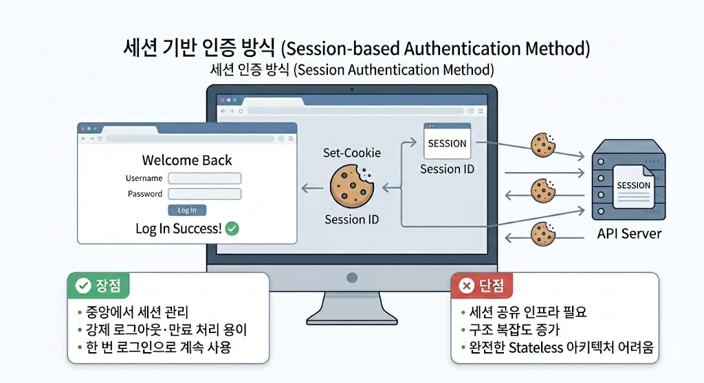

> 이 글에서는 인증·인가의 기본 개념과 인증·인가를 구현하는 방식으로 어떤 것들이 있는지 간단하게 정리해보았습니다.

## 인증과 인가

- **인증(`Authentication`)**: 사용자나 장치의 신원을 확인하는 **'누구인지 증명'하는 과정**

    > **예시:** 아이디/패스워드를 통한 로그인, 신분증·여권을 통한 본인 확인

- **인가(`Authorization`)**: 인증된 사용자가 특정 리소스에 접근할 수 있는 **'권한이 있는지 확인'** 하는 절차

    > **예시:** 관리자 페이지 접근, 자신이 작성한 게시글·댓글만 수정 가능


---


## 인증과 인가: 여러가지 구현 방법

### 여러가지 인증 방법


#### 매 요청마다 아이디/패스워드를 입력하는 인증 방식

> 매 요청마다 아이디/패스워드를 통해 사용자 검증하는 방식.


- **장점:** 구현이 가장 단순한 방식이다.

- **단점:** 요청마다 아이디/패스워드를 입력해야하여 사용자 경험(UX; User Experience) 이 좋지 않다. 또한 네트워크 통신 시 해당 정보를 탈취당할 위험이 있다.


---

#### 쿠키와 세션을 이용한 인증 방식

> 로그인에 성공한 사용자의 정보를 서버 세션에 저장하고, 세션 식별자(Session ID)를 쿠키로 내려보낸 뒤 이후 요청마다 이 세션 ID를 통해 사용자를 식별하는 방식.



- **장점:** 서버가 세션 정보를 중앙에서 관리하므로, 강제 로그아웃 처리나 세션 만료 관리가 비교적 쉽고, 사용자는 한 번 로그인으로 여러 요청을 편리하게 보낼 수 있다.

- **단점:** 세션 정보를 중앙에서 관리해야 하기 때문에 수평 확장 시 세션 공유를 위한 추가 인프라가 필요해지고, 이로 인해 복잡도가 증가하며 완전한 무상태(`Stateless`) 아키텍처를 구성하기 어렵다.


---


#### 토큰을 이용한 인증 방식

> 로그인에 성공한 사용자 정보와 권한 정보를 포함한 토큰(예: JWT)을 발급하고, 이후 요청마다 이 토큰을 함께 보내도록 하여 사용자를 식별하는 방식.


- **장점:** 서버가 세션 상태를 저장하지 않아도 되어 무상태(Stateless)에 가깝게 운영할 수 있고, 수평 확장과 다양한 클라이언트(모바일, 외부 서비스 등) 지원에 유리합니다.

- **단점:** 한 번 발급된 토큰을 서버에서 즉시 무효화하기 어렵고, 탈취 시 피해 범위가 커질 수 있어 만료 시간·재발급·블랙리스트 같은 추가 설계가 필요합니다.


---


### 여러가지 인가 방법


#### 서블릿 필터 체인 기반 인가 방식

> 서블릿 필터 체인에서 요청이 컨트롤러에 도달하기 이전에, URL·HTTP 메서드 기준으로 권한을 검사하는 방식.


- **사용 방식:** 

  애플리케이션 앞단의 서블릿 필터에서 현재 요청의 URL과 HTTP 메서드(GET, POST 등을 기준으로 접근 허용 여부를 결정합니다.
  
  예를 들어 "/admin/**" URL로 들어온 요청은 필터에서 관리자 여부를 검사한 뒤, 관리자가 아니면 컨트롤러로 넘기지 않고 바로 403을 응답합니다.

- **예시:**
  
  ```java
  public class AdminCheckFilter implements Filter {
  
      @Override
      public void doFilter(
              ServletRequest req,
              ServletResponse res,
              FilterChain chain) throws IOException, ServletException {
  
          HttpServletRequest httpReq = (HttpServletRequest) req;
          HttpServletResponse httpRes = (HttpServletResponse) res;
  
          String path = httpReq.getRequestURI();
  
          if (path.startsWith("/admin/")) {
              boolean isAdmin = checkIsAdmin(httpReq); 
  
              if (!isAdmin) {
                  httpRes.setStatus(HttpServletResponse.SC_FORBIDDEN); // 403
                  return; // 컨트롤러로 넘기지 않고 바로 응답 종료
              }
          }
  
          chain.doFilter(request, response); // 통과 시 다음 필터/컨트롤러로 진행
      }
  }
  ```
  
  위처럼 설정하면 "/admin/**" URL로 들어온 요청을 관리자가 아니면 컨트롤러로 넘기지 않고 바로 `403 Forbidden` 응답을 내려 보냅니다.

- **특징:** 

  애플리케이션 전역의 공통 인가 정책을 중앙에서 한 번에 적용하기 좋고, 권한이 없는 요청을 컨트롤러·서비스 레이어로 넘기지 않고 선제적으로 차단할 수 있습니다.


---

#### 스프링 시큐리티 설정 기반 인가 방식

> HttpSecurity#authorizeHttpRequests 같은 DSL을 사용해, 설정 코드에서 URL 패턴별·HTTP 메서드별로 필요한 역할·권한을 선언적으로 정의하는 방식.

- **사용 방식:** 

  authorizeHttpRequests 안에서 requestMatchers를 이용해 "/admin/**" 는 `hasRole("ADMIN")`, "/user/**" 는 `hasAnyRole("USER","ADMIN")`처럼, URL 패턴·HTTP 메서드별로 어떤 권한이 있어야 접근할 수 있는지를 설정합니다.

- **예시:**

  ```java
  @Bean
    public SecurityFilterChain securityFilterChain(HttpSecurity http) throws Exception {
      http.authorizeHttpRequests(auth -> auth
        .requestMatchers(HttpMethod.GET, "/admin/**").hasRole("ADMIN")
        .requestMatchers(HttpMethod.POST, "/posts/**").authenticated()
        .anyRequest().permitAll()
      );
  }
  ```
  위처럼 설정해 두면 "/admin/**" 로 들어오는 GET 요청은 자동으로 “관리자 전용 URL”로 취급되어 내부적으로 ROLE_ADMIN 보유 여부를 검사하고, 조건을 만족하지 못하면 컨트롤러에 도달하기 전에 403을 반환합니다.

- **특징:**

  보안 규칙을 한 곳(설정 클래스)에서 관리할 수 있어 “어떤 URL이 관리자 전용인지, 어떤 URL이 인증만 필요하거나 아예 모두에게 열려 있는지”를 한눈에 파악하기 쉽고, URL 구조나 권한 정책이 바뀔 때도 설정 코드만 수정하면 되어 유지보수가 수월합니다.

---
