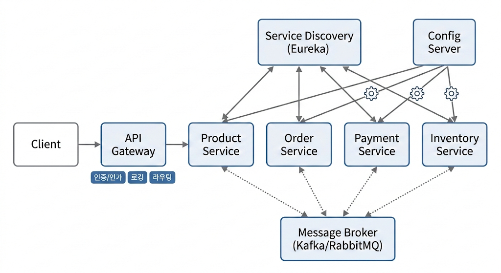

> **이 글에서 모놀리틱 아키텍처(`Monolithic Architecture`)와 마이크로 서비스 아키텍처(`MSA; Micro Service Architecture`)가 무엇이고 어떠한 특징을 가지는지 정리했습니다.**

## Spring Cloud: 너는 누구니 ?

Spring Cloud는 스프링 애플리케이션에서 분산 시스템(`Distributed System`)에 자주 등장하는 구성 관리, 서비스 검색, 마이크로 프록시 등의 기능을 빠르게 구현할 수 있도록 도와주는 솔루션입니다.
특히 MSA 처럼 서비스를 여러 개로 쪼갰을 때 공통적으로 필요해지는 인프라 기능들을 라이브러리 형태로 추상화해 제공합니다.

---

### Spring Cloud: MSA 에서 생기는 문제

모놀리틱 구조의 애플리케이션을 MSA 구조로 분리하면 서비스를 독립적으로 배포·확장할 수 있는 유연성을 얻는 대신, 인프라 레벨에서 새로운 문제들이 아래와 같이 등장합니다.

1. **독립적인 서비스의 동적인 서비스 주소** 

   각 서비스가 독립적으로 동작하고, 계속 생겼다가 사라지는 환경에서 서비스 주소(`IP:PORT`)가 고정돼 있지 않아 **어떤 프로세스가 어디에 떠 있는지 찾아주는 서비스 디스커버리와 로드 밸런싱 이 필요** 합니다.

2. **각 서비스의 독립적인 설정 파일**

   모놀리틱 애플리케이션에서는 하나의 설정만 관리하면 되지만, **MSA는 서비스 수만큼 설정 파일이 생겨 관리가 어렵습니다.** 
   
    이를 중앙에서 통합 관리하지 않으면 설정 상태와 버전을 파악하기 어렵고, 환경별 설정이 뒤섞이는 문제가 발생합니다. 

3. **클라이언트의 서비스 접근 지점 분산**

    서비스 주소가 자주 바뀌는 환경에서 클라이언트가 **각 엔드포인트를 직접 바라보면 주소 변경에 취약하고, 인증·인가 같은 공통 기능을 서비스마다 중복 구현**해야 합니다.
    
    그래서 **API 게이트웨이 하나로 진입점을 고정**하고, **내부 라우팅과 서비스 디스커버리를 함께 맡기는 패턴을 많이 사용**합니다.

4. **네트워크 장애와 부분 실패에 대한 대응**

   모놀리틱에서는 메서드 호출로 끝나던 통신이 **MSA에서는 네트워크 호출로 바뀌면서, 일부 서비스 장애가 연쇄 장애로 번지기 쉽습니다.** 

   그래서 **타임아웃·재시도·서킷 브레이커 같은 회복 패턴**과, **분산된 로그·메트릭·트레이스를 한곳에서 모아 보는 관측 체계가 필수**가 됩니다.

---

### Spring Cloud: MSA 아키텍처 구조 미리보기

> 아래 이미지는 Gemini Nano Banana2 로 생성하였습니다.

---

- **API Gateway**

  클라이언트는 여러 **서비스를 직접 호출하지 않고, API Gateway 를 호출**합니다.  
  
  Gateway는 인증·인가, 로깅, 라우팅 같은 공통 기능을 처리한 뒤, 요청 URL·HTTP 메서드·헤더 등의 라우팅 규칙에 따라 적절한 마이크로서비스로 요청을 전달합니다.

- **Service Discovery (Eureka)**

  각 마이크로서비스는 자신의 인스턴스 정보를 Eureka에 등록하고, 다른 서비스는 Eureka를 통해 대상 서비스의 위치를 조회함으로써,
  서비스 주소가 자주 바뀌는 환경에서도, **개별 서비스가 서로의 IP·포트에 직접 의존하지 않기 때문에 서비스 간 결합도를 낮출 수 있습니다.**

- **Config Server**  

  여러 **서비스의 설정을 Git이나 파일 시스템 같은 외부 저장소 한 곳에서 관리**하고, 서비스는 **부팅 시점에 Config Server에서 이를 읽어 적용**합니다.
  
  공통 설정과 서비스별 설정을 분리해 재사용할 수 있고, `/actuator/refresh` 같은 기능을 이용하면 코드 배포 없이도 런타임에 설정을 변경·반영할 수 있습니다.

- **Message Broker(Kafka/RabbitMQ)**  

  주문 생성, 결제 완료와 같은 이벤트를 메시지 브로커를 통해 발행·구독하게 하면 **서비스 간 통신 일부를 비동기 이벤트 기반으로 처리**할 수 있습니다.
  
  이 방식은 서비스 간 결합도를 낮추고, 소비 서비스의 처리 속도에 맞춰 메시지를 버퍼링할 수 있어 트래픽 급증이나 일시적인 장애에도 더 유연하게 대응하게 해 줍니다

---

