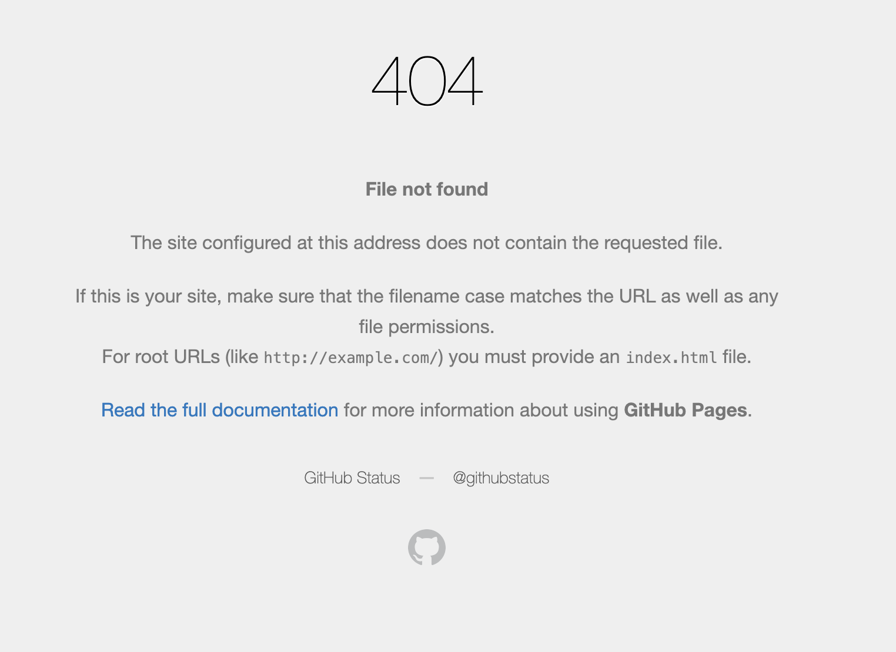
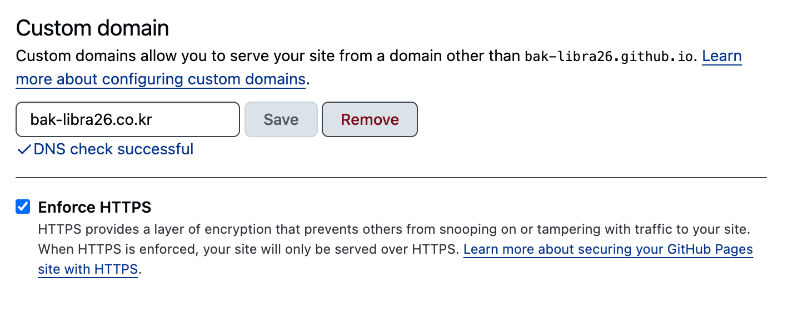

> 이 글은 리액트로 구성한 프로젝트를 깃허브 페이지로 배포하는 과정을 정리한 글입니다.

## 블로그: 개발 환경과 스택

제가 만든 블로그는 Vite와 리액트 19 버전을 기반으로 개발했고, 깃허브 페이지(GitHub Pages)를 통해 정적 사이트 형태로 배포했습니다.
깃허브 페이지는 정적 웹 사이트를 무료로 호스팅할 수 있는 서비스라, 별도 서버 없이도 손쉽게 배포 환경을 구성할 수 있었습니다.


| 구분       | 내용                            |
|-----------|-------------------------------|
| 빌드 도구 | Vite                          |
| 프레임워크 | 리액트 19                        |
| 배포 방식 | 깃허브 페이지(GitHub Pages) |

사용하는 기술 스택에 따라 설정 방법이 조금씩 달라질 수 있어 Vite + 리액트 19 를 기준으로 작성된 글임을 참고해 주세요.

---


## 블로그: 깃허브 페이지 배포하기

이제 실제로 이 블로그를 깃허브 페이지에 올리기 위해, 배포에 필요한 스크립트를 먼저 정리하겠습니다.
`Vite`로 빌드한 정적 파일을 깃허브 페이지에서 바로 호스팅할 수 있도록, `package.json`에 빌드·배포용 명령을 추가해서 배포 작업을 자동화해보겠습니다.


---


### 스크립트 작성하기

배포 자동화를 위해 `package.json`의 `scripts`에 `deploy` 명령을 추가해야합니다.

- 배포를 위한 `package.json` 수정
    ```json {4-6}
    {
      ...
      "scripts": {
        "dev": "vite --host",
        "build": "vite build",
        ...
        "deploy": "gh-pages -d dist -t"
      },
      ...
    }
    ```

위와 같이 수정하고 `npm run build` 명령어를 실행하면 프로젝트 루트에 빌드 결과물에 해당하는 `dist` 폴더가 생성됩니다.
이후에 `npm run deploy` 를 실행하면 `gh-pages` 를 통해 빌드된 정적 파일(`/dist/*`)을 깃허브 페이지 전용 브랜치(`gh-pages`)에 업로드됩니다.

---

### 배포 확인하기

- **명령어 실행 후 체크리스트**
  1. **`gh-pages` 브랜치 생성 여부 확인**
  2. **`gh-pages` 브랜치 안에 빌드 결과물(`dist`) 정상 배포 여부 확인**

위 두 가지가 확인되었다면 잠시 후에 깃허브 페이지가 제공하는 주소(`https://{깃허브 계정}.github.io`)로 접속했을 때 배포된 웹 페이지가 확인됩니다. 


---

### 트러블 슈팅: 404: 페이지를 찾지 못했습니다.


- **배포 후, 404: 페이지를 찾지 못하는 경우.**


---


- **`BrowserRouter` 설정 확인**

    GitHub Pages에서 서브 경로로 배포하는 경우, 라우터의 basename이 실제 서비스 주소와 맞지 않으면 새로고침이나 직접 URL 입력 시 404가 발생할 수 있습니다.
    `<BrowserRouter base='/'>...</BrowserRouter>` 로 되어있다면 `bak-libra26.github.io`와 같이 `${계정}.github.io` 와 같은 깃허브 페이지 주소로 변경해주어야합니다.
        
    ```jsx
    const basename = import.meta.env.MODE === 'development' ? '/' : '/bak-libra26.github.io'; // 혹은 실제 배포 경로
    
    <BrowserRouter basename={basename}>
    ...
    </BrowserRouter>
    
    ```
     

- **`<a>` 를 `<Link>` 로 변경하기**

  리액트 라우터를 사용하는 `SPA(Single Page Application)`에서 내부 페이지 이동에 `<a>` 태그를 사용하는 경우, 브라우저가 전체 페이지를 새로 요청하고 깃허브 페이지는 해당 경로에 정적 파일을 직접 찾게되어 404가 발생합니다.
  이를 방지하기 위해서 내부 라우팅에는 `<a>` 대신 리액트 라우터에서 제공하는 `<Link>` 컴포넌트를 사용해야 합니다.


## 블로그: 깃허브 페이지 도메인 & DNS 설정

### 사용할 도메인 결제

먼저 블로그에 연결할 도메인을 구매해야합니다.
가비아, 닷네임코리아, Cloudflare 등 도메인 구매 사이트를 이용해서 도메인을 구매해주세요.
참고로 저는 [호스팅케이알](https://www.hosting.kr/) 에서 구매했습니다.

---

### 깃허브 페이지 설정

- 깃허브 페이지 설정
    

1. 레포지토리의 `Settings` > `Pages`로 이동합니다.
2. `Custom domain`에 연결할 도메인(예: bak-libra26.co.kr)을 적은 후 저장합니다.
3. `SSL` 인증서 발급이 완료되면 `Enforce HTTPS` 옵션을 체크하여 항상 `HTTPS`로 접속되게 설정합니다.

---

### CNAME 추가

깃허브 페이지 설정 화면에서 `Custom domain`을 저장하면 레포지토리 루트에 CNAME 파일이 생성되지만, 빌드/배포 과정에서 이 파일이 사라지는 경우가 있습니다.
이걸 대비해서 프로젝트의 루트에 `public` 를 만들어 `CNAME` 파일을 직접 추가해두겠습니다.

- `/public/CNAME` 파일 추가
  ```text
  bak-libra26.co.kr
  ```
  

### A 레코드 추가

`bak-libra26.co.kr` 과 같은 루트 도메인 바로 접속하고 싶은 경우에 `DNS` 설정에서 `A 레코드`를 추가하여 `GitHub Pages IP`로 향하도록 설정해야 합니다.
도메인을 구매한 업체의 사이트의 `DNS 설정 페이지`에서 아래처럼 `A 레코드`를 추가해 주세요.

> [깃허브 페이지 | 사용자 지정 도메인 관리](https://docs.github.com/ko/pages/configuring-a-custom-domain-for-your-github-pages-site/managing-a-custom-domain-for-your-github-pages-site) 를 참고하셔도 좋아요

```text
타입: A
호스트: @
값: 185.199.108.153
값: 185.199.109.153
값: 185.199.110.153
값: 185.199.111.153
```

- `@`는 루트 도메인(`bak-libra26.co.kr`)을 의미합니다.
- `깃허브 페이지 IP`는 여러 개를 모두 추가하는 것이 좋습니다.


---